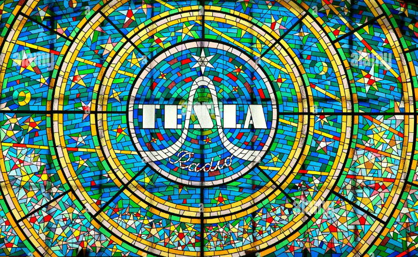

# SRgen (mosaic generator)

SRgen is a tool that allows you to construct an image from another image serving as a pattern.

There are three versions available:
- the most generic Java version
- somewhat generic C version (optimized for speed)
- sin/cos transform optimized C version (the fastest of all, ~270x faster than Java version, ~6x faster than generic C version)

## Building
To build C version, simply run:
```
clang -Ofast -march=skylake-avx512 src/SR.c -o bin/SR
# or with gcc / MSVC
```

To build Java version, you might as well compile the Java to JAR and run it
```
mkdir build/
javac -d ./build src/*.java
cd build
jar -cfe ../bin/SR.jar SR * 
cd ..
```

## Usage

### Running C version:
```
./bin/SR --in input_image.bmp --pattern pattern_image.bmp --out output_image.bmp
```
**C version only works with BMP images in BGR24 format!**

### Running Java verson
```
java -jar ./bin/SR.jar --in input_image.bmp --pattern pattern_image.bmp --out output_image.bmp
```

Java supports many image formats, i.e. JPG, PNG, BMP.
It also supports following arguments:

```
--size N    -   log2(N) size of block, i.e. 3 => 8 x 8 pixel blocks
--scheme yuv1/yuv2/rgb1/rgb3/rgb6   -   color scheme to match similarities against
--blend     -   if set, original hue is used instead of pattern hue
```

### Running with many frames
To run the application over multiple frames, you can specify input/output path as formatted path, i.e.
```
# ffmpeg -i Video.mp4 -pix_fmt bgr24 frames/frame%04d.bmp
./bin/SR --in frames/frame%04d.bmp --pattern VanGogh.bmp --out out/frame%04d.bmp
# ffmpeg -framerate 29.97 -i out/frame%04d.bmp Result.mp4
```

## Example results
Multiple frames


Input image:


Pattern image:



Block size log = 3, transform = rgb3, transforms = 2